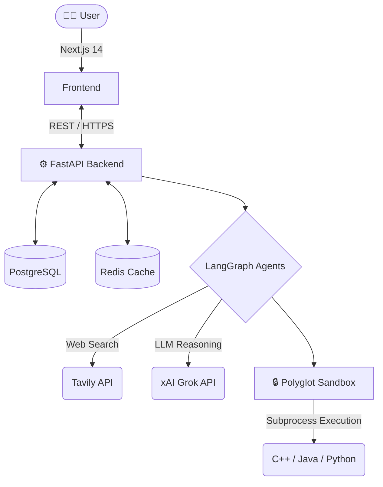

<div align="center">
  <h1>🧠 DevBrain AI</h1>
  <p><strong>Your Personal AI Senior Staff Engineer & Mentor</strong></p>
  
  <p>
    <a href="#features">Features</a> •
    <a href="#architecture">Architecture</a> •
    <a href="#tech-stack">Tech Stack</a> •
    <a href="#getting-started">Getting Started</a>
  </p>

  
  
  
  
</div>

<br/>

DevBrain AI isn't just another code assistant—it's an **adaptive developer growth platform** powered by advanced autonomous agents. It connects directly to your GitHub, statistically analyzes your actual codebase history, and builds a hyper-personalized skill profile. 

Using multi-agent architectures (via **LangGraph**) and a secure **Polyglot Execution Sandbox**, DevBrain generates daily challenges, reviews your code with deep reasoning, and actively patches your knowledge gaps.

---

## ✨ Features That Feel Like Magic

### 🕵️‍♂️ GitHub Skill Profiling
Forget self-assessments. DevBrain scans your repositories, languages, and commit density to deterministically calculate your true technical proficiency across different domains. 

### 🤖 Agentic Self-Evaluating Challenges
DevBrain doesn't just hallucinate coding problems. 
1. The **Resource Agent** searches the internet (via Tavily) to source real, mathematically proven constraints from classic algorithms.
2. The **Challenge Agent** generates a problem tailored exactly to your weakest skill.
3. *Crucially*, before you ever see it, the agent **writes its own solution and executes it against its own test cases in a secure backend sandbox**. If its math is wrong, it fixes it autonomously. You only see 100% verified challenges.

### ⚡ Polyglot Execution Sandbox
Whether you write your solution in **C++, Java, or Python**, DevBrain's custom backend transpiler dynamically compiles your code, injects the generated test cases, and evaluates it with sub-second latency.

### 🔄 Multi-Pass AI Code Review
Why settle for a single LLM output? When you submit code, our Code Review Agent uses a **LangGraph reflection loop**. It generates a review, scores its own review out of 1.0, and if the quality is below a strict threshold, it rewrites the review to be deeper and more actionable.

---

## 🏗️ Architecture

DevBrain is built for speed, scale, and intelligence.



### 🧠 The Agents
- **Challenge Agent**: Finds your weakest skill and generates/validates coding problems.
- **Review Agent**: A cyclic reasoning loop that provides Senior-level code critiques.
- **Roadmap Agent**: Designs a dynamic 6-week curriculum based on your GitHub gaps.

---

## 💻 Tech Stack

### Backend
- **Python 3.11 & FastAPI**: Fully asynchronous, heavily typed, blazing fast.
- **LangGraph & xAI (Grok)**: For complex multi-agent reasoning loops.
- **PostgreSQL & asyncpg**: Primary relational data store using JSONB and UUIDs.
- **Redis**: Low-latency caching for skill profiles and rate-limiting.

### Frontend
- **Next.js 14 (App Router)**: React Server Components and edge-optimized routing.
- **Tailwind CSS**: For a stunning, modern, and highly responsive UI.
- **Monaco Editor**: Embedded VS Code-like coding experience directly in the browser.

---

## 🚀 Getting Started

Want to run DevBrain locally? It's incredibly easy to spin up.

### Prerequisites
- Python 3.11+
- Node.js 20+
- Docker & Docker Compose
- API Keys: xAI (Grok), GitHub OAuth, Tavily

### Installation (Local Hybrid Workflow)

The recommended way to run DevBrain locally is a **hybrid workflow**: run the databases via Docker, but run the Backend and Frontend natively for instant hot-reloading and easier debugging.

1. **Clone & Configure**
   ```bash
   git clone https://github.com/your-username/devbrain.git
   cd devbrain
   
   # Set up your environment variables
   cp backend/.env.example backend/.env
   # Edit .env with your API keys
   ```

2. **Spin up Postgres & Redis**
   ```bash
   # Run only the database services in the background
   docker compose up -d postgres redis
   ```

3. **Start the FastAPI Backend**
   Open a new terminal in the `backend/` directory:
   ```bash
   cd backend
   
   # Windows
   venv\Scripts\activate
   # Mac/Linux
   # source venv/bin/activate
   
   # Install dependencies if you haven't yet
   pip install -r requirements.txt
   
   # Run the server
   uvicorn main:app --reload --port 8000
   ```

4. **Start the Next.js Frontend**
   Open a third terminal in the `frontend/` directory:
   ```bash
   cd frontend
   
   # Install dependencies
   npm install
   
   # Start the dev server
   npm run dev
   ```

5. **Access the App**
   - 🌐 App: `http://localhost:3000`
   - 📖 API Docs: `http://localhost:8000/docs`

---

## 🛠️ For Developers & Contributors

DevBrain is built with a pristine, linted, and highly modular codebase. 
To clear your database during rapid iteration, simply run:
```bash
cd backend
python master_clear_db.py
```

### Future Roadmap
- **Peer Comparison:** Anonymized skill comparison against similar-level developers.
- **Mock Interviews:** Adaptive conversational DSA and System Design interviews.
- **Resume Gap Analysis:** Automatically match your GitHub skill graph against job descriptions.

<br/>

<div align="center">
  <p>Built with ❤️ for developers who want to level up.</p>
</div>